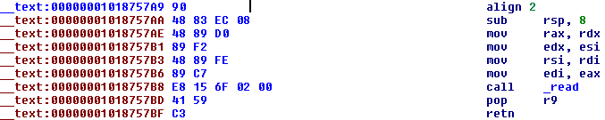

# Tracking Input with DTrace on OS X

Date: 2015-05-17

When performing reverse engineering whether for vulnerability research or malware analysis at some point you will need to track input data. Usually one would start from the point of entry of the input and follow the code flow from there. This can be achieved via debugger: setting BPs on interesting points and slowly moving through each break inspecting arguments and return values of called functions. On top of that, if our debugger of choice supports scripting then we can try to automate this process. In this post I will focus on introducing similar automated functionality with DTrace for OS X platform (some minor tweaks may be required for other supported platforms).

## Plan of action

Our solution will be simple. We will try to mimic what we would normally do under the debugger and to achieve this we will put DTrace probes at places that are interesting to us. For the following article these are `open()` and `read()` functions from the C library. Of course the more you know about your targeted application the better choice you will make.

> To list all functions that can be probed run `$ sudo dtrace -ln 'pid$target:::entry {}' -c <app>`.

Our plan of action can be summarized as:

1. Enumerate interesting functions
2. Set-up probes at points of interest
3. Dump the data
4. Look for known input

For this article we already have our targets but if that would not be the case, we could for example trace `open()` system call via `syscall` provider and dump its first argument along with user callstack. Usually this would give us nice overview of the code flow. For setting-up probes we could also utilize `syscall` provider, however I will use `pid` provider to gain better performance. Data dumping is done via `tracemem` on appropriate pointers used by `read()`. Finally, looking for known input is done by the machine operator - you.

> DTrace does not support loops or actual if statements (probe predicates and `?:` operator do not count) and that is why we cannot fully automate our script, hence requirement for manual inspection.

This approach is somewhat similar to what [Peter](http://dvlabs.tippingpoint.com/blog/2011/07/26/hooking-readfile-and-mapviewoffile) and [Brandon](http://dvlabs.tippingpoint.com/blog/2012/04/02/mindshare-vtrace-input-tracking) did in MindshaRE couple of years ago. But as opposed to Peter we do not need to manually patch any partciular function, just observe at the point of entry/return which is similar to [Detours](http://research.microsoft.com/en-us/projects/detours/) mentioned in the comment section of his post.

## Implementation

First of all we want to probe entry of the `open()` function along with a predicate on the file that is interesting to us:

```
pid$target::__open:entry
/copyinstr(arg0) == "/Users/ad/Desktop/test.mp3"/
{
    self->fname = copyinstr(arg0);
    self->openok = 1;
}
```

The only actions we are taking inside of this probe are setting thread-local variables `self->fname` and `self->openok` which we will use in our next probe:

```
pid$target::__open:return
/self->openok/
{
    trackedfd[arg1] = 1;
    printf("Opening %s with fd %#x\n", self->fname, arg1);
    self->fname = 0;
    self->openok = 0;
}
```

As you can see, the probe is set on return of the `open()` and we are using `self->openok` variable as a condition to make sure we are in a proper `open()` return (execution wise). Inside of the probe we are doing couple of things:

* Setting a flag for opened file descriptor inside of the global array `trackedfd[]` (`arg1` holds return value)
* Printing out logging information
* Freeing variables

After this we are ready to monitor any function that makes use of marked file descriptor. In our case this function is `read()`:

```
pid$target::read:entry
/trackedfd[arg0] == 1/
{
    self->rfd = arg0;
    self->rbuf = arg1;
    self->rsz = arg2;
}

pid$target::read:return
/self->rfd/
{
    printf("Reading from fd %#p to buf %#p size %#x\n", self->rfd, self->rbuf, self->rsz);
    tracemem(copyin(self->rbuf, arg1), 64);
    ustack(); printf("\n");
    self->rfd = 0;
    self->rbuf = 0;
    self->rsz = 0;
}
```

Probe set on entry of `read()` should be self-explanatory by now. The probe set on return does logging, dumping of `read()'s` destination buffer, and displaying user-mode callstack.

As a last step we will zero-out file descriptor flag stored by `trackedfd[]` array in `close()` function:

```
pid$target::close:entry
/trackedfd[arg0] == 1/
{
    trackedfd[arg0] = 0;
}
```

After putting it all together we get the following script:

```
#!/usr/sbin/dtrace -s

#pragma D option destructive
#pragma D option quiet

BEGIN
{
    trackedfd[0] = 0;
}

pid$target::__open:entry
/copyinstr(arg0) == "/Users/ad/Desktop/test.mp3"/
{
    self->fname = copyinstr(arg0);
    self->openok = 1;
}

pid$target::__open:return
/self->openok/
{
    trackedfd[arg1] = 1;
    printf("Opening %s with fd %#x\n", self->fname, arg1);
    self->fname = 0;
    self->openok = 0;
}

pid$target::read:entry
/trackedfd[arg0] == 1/
{
    self->rfd = arg0;
    self->rbuf = arg1;
    self->rsz = arg2;
}

pid$target::read:return
/self->rfd/
{
    printf("Reading from fd %#p to buf %#p size %#x\n", self->rfd, self->rbuf, self->rsz);
    tracemem(copyin(self->rbuf, arg1), 64);
    ustack(); printf("\n");
    self->rfd = 0;
    self->rbuf = 0;
    self->rsz = 0;
}

pid$target::close:entry
/trackedfd[arg0] == 1/
{
    trackedfd[arg0] = 0;
}
```

You can see that I have silently added 2 `#pragmas`, you can read about them [here](https://wikis.oracle.com/display/DTrace/Options+and+Tunables). I have also used `BEGIN` clause to initialize global array `trackedfd[]`.

## Usage example

For a quick and simplified example of tracing I will use VOX music player which is freely avilable on the Mac App Store, so without further ado:

```
Wed May 13 08:24 PM ttys008 [ad@mbp ~]
$ sudo ./fileinput.d -p 31337 > VOX.trace
^C

Wed May 13 08:24 PM ttys008 [ad@mbp ~]
$ less VOX.trace

Opening /Users/ad/Desktop/test.mp3 with fd 0x15
Opening /Users/ad/Desktop/test.mp3 with fd 0x15
Reading from fd 0x15 to buf 0x111fda108 size 0x1000

             0  1  2  3  4  5  6  7  8  9  a  b  c  d  e  f  0123456789abcdef
         0: 49 44 33 03 00 00 00 00 23 76 54 49 54 32 00 00  ID3.....#vTIT2..
        10: 00 1b 00 00 00 54 72 61 76 65 6c 65 72 20 69 6e  .....Traveler in
        20: 20 74 68 65 20 57 6f 6e 64 65 72 6c 61 6e 64 54   the WonderlandT
        30: 59 45 52 00 00 00 05 00 00 00 32 30 30 35 54 50  YER.......2005TP

              libsystem_kernel.dylib`read+0x14
              libbass.dylib`BASS_ErrorGetCode+0x1e1

	[ ... ]
```

We seem to successfully tracked our input but the callstack does not look good (seems too small). Disassembling `libbass.dylib` and jumping to `BASS_ErrorGetCode+0x1e1` results in the following code chunk:



This code chunk is unusual. It does not contain any references (that is why IDA fails to recognize it as a function) and it lacks function prologue (that is why DTrace fails to display full call stack). Most probably it is a dynamic call, we can verify this assumption by inspecting the application inside of lldb:

```
(lldb) attach -p 31337
Process 31337 stopped
* thread #1: tid = 0x250206, 0x00007fff977ad4de libsystem_kernel.dylib`mach_msg_trap + 10, queue = 'com.apple.main-thread', stop reason = signal SIGSTOP
    frame #0: 0x00007fff977ad4de libsystem_kernel.dylib`mach_msg_trap + 10
libsystem_kernel.dylib`mach_msg_trap:
->  0x7fff977ad4de <+10>: ret
    0x7fff977ad4df <+11>: nop

libsystem_kernel.dylib`mach_msg_overwrite_trap:
    0x7fff977ad4e0 <+0>:  mov    r10, rcx
    0x7fff977ad4e3 <+3>:  mov    eax, 0x1000020

Executable module set to "/Applications/VOX.app/Contents/MacOS/VOX".
Architecture set to: x86_64-apple-macosx.
(lldb) image list

	[ ... ]

[230]                                      0x000000010186d000 /Applications/VOX.app/Contents/Frameworks/VXBass.framework/Versions/A/libbass.dylib

	[ ... ]

(lldb) b 0x00000001018757ae
Breakpoint 1: where = libbass.dylib`___lldb_unnamed_function122$$libbass.dylib + 4, address = 0x00000001018757ae
(lldb) c
Process 31337 resuming
Process 31337 stopped
* thread #18: tid = 0x2504d9, 0x00000001018757ae libbass.dylib`___lldb_unnamed_function122$$libbass.dylib + 4, stop reason = breakpoint 1.1
    frame #0: 0x00000001018757ae libbass.dylib`___lldb_unnamed_function122$$libbass.dylib + 4
libbass.dylib`___lldb_unnamed_function122$$libbass.dylib:
->  0x1018757ae <+4>:  mov    rax, rdx
    0x1018757b1 <+7>:  mov    edx, esi
    0x1018757b3 <+9>:  mov    rsi, rdi
    0x1018757b6 <+12>: mov    edi, eax
(lldb) x/80x $rdi
0x1087a9108: 0x00000000 0x00000000 0x00000000 0x00000000
0x1087a9118: 0x00000000 0x00000000 0x00000000 0x00000000
0x1087a9128: 0x00000000 0x00000000 0x00000000 0x00000000
0x1087a9138: 0x00000000 0x00000000 0x00000000 0x00000000

	[ ... ]

	[ ... ]

	[ ... ]

(lldb) c
Process 31337 resuming
Process 31337 stopped
* thread #18: tid = 0x2504d9, 0x00000001018757ae libbass.dylib`___lldb_unnamed_function122$$libbass.dylib + 4, stop reason = breakpoint 1.1
    frame #0: 0x00000001018757ae libbass.dylib`___lldb_unnamed_function122$$libbass.dylib + 4
libbass.dylib`___lldb_unnamed_function122$$libbass.dylib:
->  0x1018757ae <+4>:  mov    rax, rdx
    0x1018757b1 <+7>:  mov    edx, esi
    0x1018757b3 <+9>:  mov    rsi, rdi
    0x1018757b6 <+12>: mov    edi, eax
(lldb) x/80x $rdi
0x1087b2199: 0x00000000 0x00000000 0x00000000 0x00000000
0x1087b21a9: 0x55555500 0x55555555 0x55555555 0x55555555
0x1087b21b9: 0x54474154 0x65766172 0x2072656c 0x74206e69
0x1087b21c9: 0x57206568 0x65646e6f 0x6e616c72 0x00000064
0x1087b21d9: 0x73755300 0x20756d75 0x6f6b6f59 0x00006174
0x1087b21e9: 0x00000000 0x00000000 0x00000000 0x53000000
0x1087b21f9: 0x6f626d79 0x0000006c 0x00000000 0x00000000
0x1087b2209: 0x00000000 0x00000000 0x00000000 0x30303200
0x1087b2219: 0x20202035 0x20202020 0x20202020 0x20202020
0x1087b2229: 0x20202020 0x20202020 0x20202020 0x0c030020

	[ ... ]

(lldb) bt
* thread #18: tid = 0x2504d9, 0x00000001018757ae libbass.dylib`___lldb_unnamed_function122$$libbass.dylib + 4, stop reason = breakpoint 1.1
  * frame #0: 0x00000001018757ae libbass.dylib`___lldb_unnamed_function122$$libbass.dylib + 4
    <b>frame #1: 0x0000000101879559 libbass.dylib`___lldb_unnamed_function171$$libbass.dylib + 163</b>
    frame #2: 0x00007fff95f36268 libsystem_pthread.dylib`_pthread_body + 131
    frame #3: 0x00007fff95f361e5 libsystem_pthread.dylib`_pthread_start + 176
    frame #4: 0x00007fff95f3441d libsystem_pthread.dylib`thread_start + 13
```

Following missing callstack entry leads us to a dynamic function call located at `libbass+0xc556`:

```
[ ... ]

000000010187951F     loc_10187951F:
000000010187951F 028 mov     ecx, [rbp+0F8h]
0000000101879525 028 mov     eax, [rbp+0FCh]
000000010187952B 028 add     rax, [rbp+100h]
0000000101879532 028 mov     edx, ecx
0000000101879534 028 mov     rbx, rdx
0000000101879537 028 xor     edx, edx
0000000101879539 028 div     rbx
000000010187953C 028 mov     eax, edx
000000010187953E 028 sub     ecx, edx
0000000101879540 028 cmp     esi, ecx
0000000101879542 028 mov     r12d, ecx
0000000101879545 028 cmovbe  r12d, esi
0000000101879549 028 mov     rdx, [rbp+50h]
000000010187954D 028 cdqe
000000010187954F 028 lea     rdi, [r14+rax]
0000000101879553 028 mov     esi, r12d
0000000101879556 028 call    qword ptr [rbp+40h] ; dynamic call into read wrapper
0000000101879559 028 mov     ebx, eax
000000010187955B 028 cmp     eax, 0FFFFFFFFh
000000010187955E 028 jnz     short loc_1018

[ ... ]
```

This seems to be the function that dispatches data reads and probably somewhere down the road parsing is taking place.

Also you have probably noticed that callstack from lldb, although better than from DTrace's output, is still poor. It is the result of pthreads usage which cripples our dynamic analysis.

## Conclusions

We successfully found the code responsible for input entry and from there we could start more tailored tracing operation in order to find code responsible for parsing data. The real strength of DTrace lies in a fast ad-hoc style analysis, we can quickly gain a lot of useful information which otherwise would require more work. DTrace has its own limitations and it is not a silver bullet (all in all we needed to use lldb), however one can often save a lot of time utilizing its power which comes for free for any OS X installation.

gl, hf.
