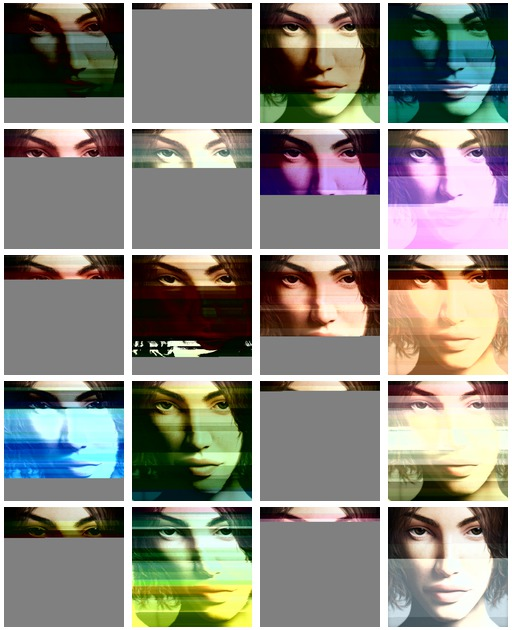
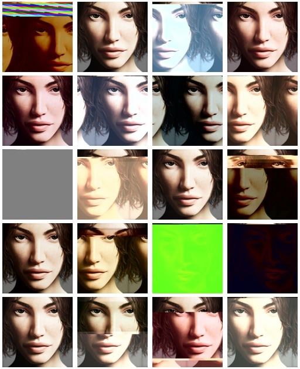

# Why You Should Use Radamsa

Date: 2014-05-04

During my time at [Secunia](http://secunia.com) I’ve seen a lot of fuzzing results published either publicly or privately (via [SVCRP](http://secunia.com/community/research/svcrp/)). What struck me at the time was that most of them were made via random bit flip. While this approach is certainly the easiest and fastest to implement and execute, there are other ways to mutate data. One of them is to use [radamsa](https://gitlab.com/akihe/radamsa).

They say that a picture is worth a thousand words, hence we will make a comparison between random bit flip and radamsa with images and our eyes as parsers (more scientific, thus correct, approach would be to collect and compare code coverage data).

Below you can see the results of a random bit flip approach on this [seed](assets/2014-05-04-seed.jpg) file (1-to-256 changes of 1/2/4 byte(s) size):

The images are broken in a chaotic fashion. Additionally they all seem to be quite similar.

Now, using radamsa we can get somewhat different set of mutations:

This time images are less broken and mutations seem to be less chaotic. Also we can observe more structural variations (e.g. re-ordered chunks).

We can clearly spot the differences between these two approaches and so can parsers, hence next time when designing your fuzzing operation you should think about incorporating radamsa as one of your mutation engines.

For grids crafting I’ve used ImageMagick’s [montage tool](http://www.imagemagick.org/Usage/montage/) (hence we basically tested how ImageMagick's parser _sees_ things).

gl, hf.
